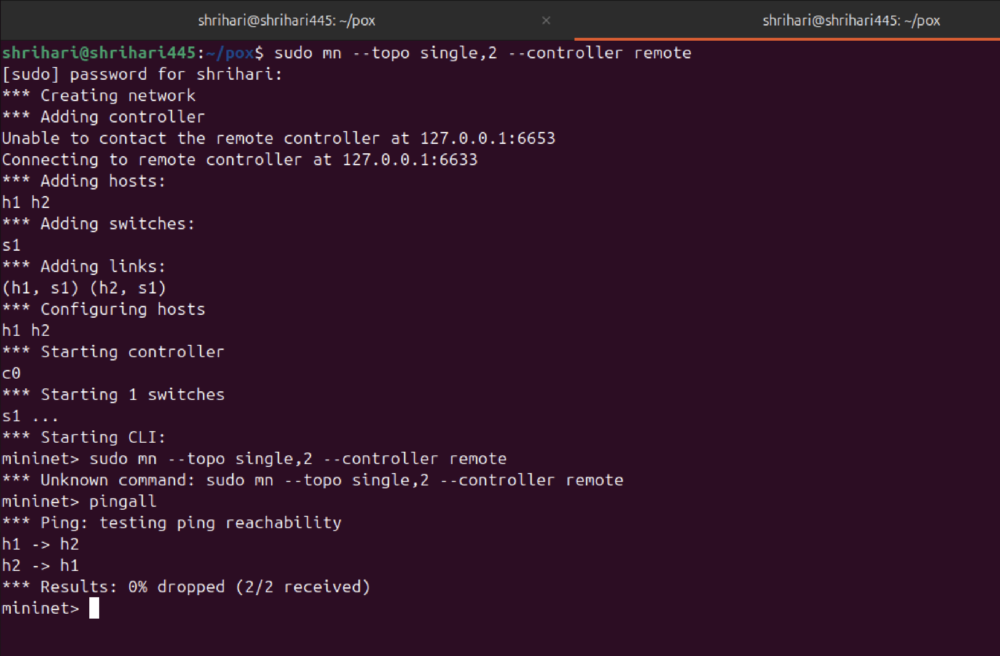
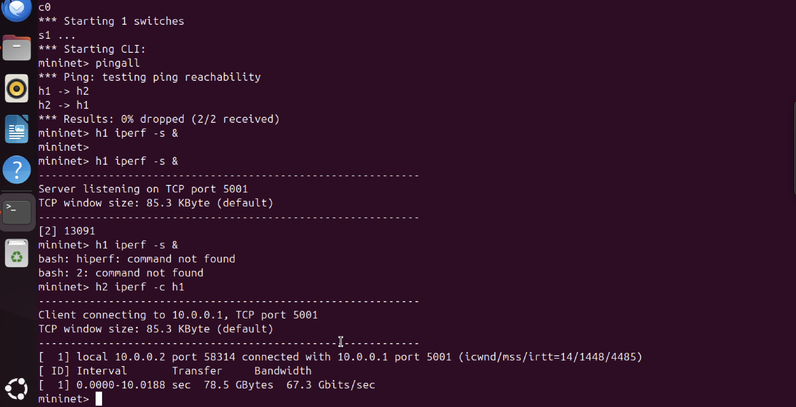
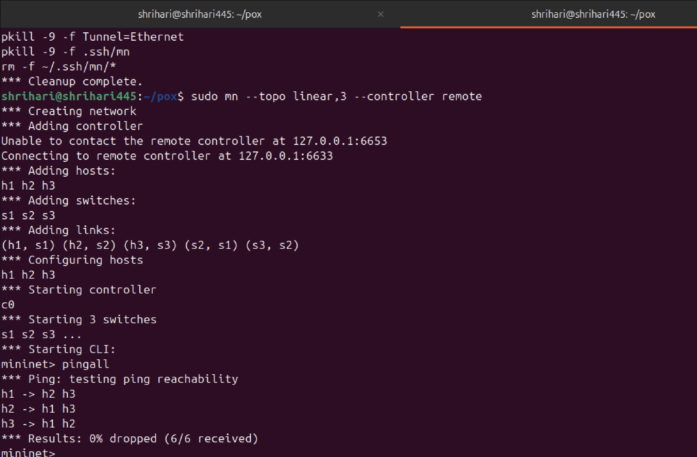
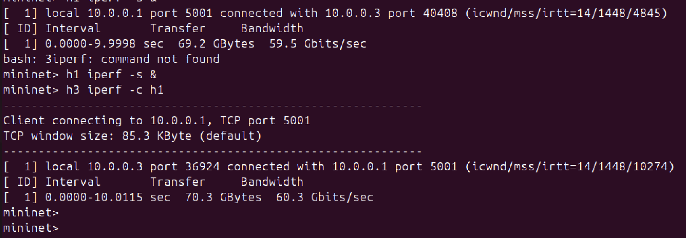
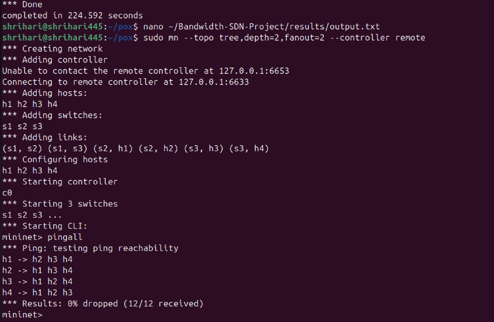
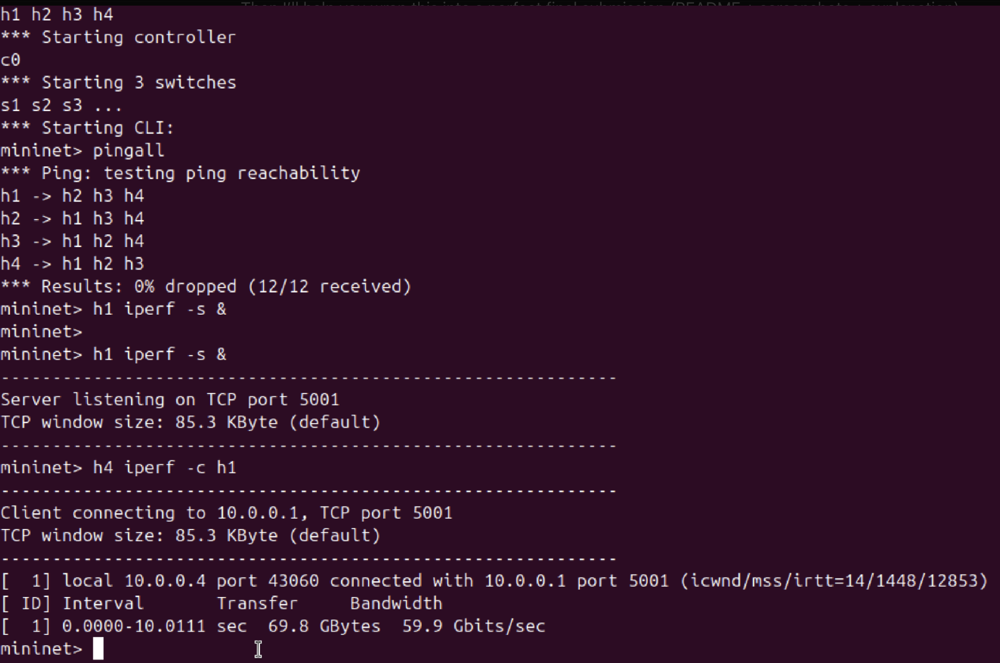

# 📊 Bandwidth Measurement and Analysis using SDN (Mininet + POX)

## 👤 Author

Shrihari Nagesh
SRN: PES1UG24CS445

---

## 🚀 Project Overview

This project demonstrates how Software Defined Networking (SDN) can be used to measure and analyze network bandwidth using Mininet and the POX controller.

---

## 🛠️ Tools & Technologies

* Mininet
* POX Controller
* Python
* iperf

---

## ⚙️ Setup Instructions

### 1. Start POX Controller

```
cd ~/pox
./pox.py forwarding.l2_learning
```

### 2. Run Mininet Topology

```
sudo mn --topo single,2 --controller remote
```

---

## 📡 Testing Connectivity

```
pingall
```

---

## 📊 Bandwidth Measurement

Start server:

```
h1 iperf -s &
```

Run client:

```
h2 iperf -c h1
```

---

## 📈 Sample Output

* Bandwidth: ~68 Gbps
* Packet loss: 0%

---

## 📂 Project Structure

```
Bandwidth-SDN-Project/
│
├── controller/
│   └── bandwidth_controller.py
│
├── results/
│   ├── screenshots/
│   └── output.txt
│
├── README.md
```

## Results

### Single Topology



Bandwidth: 67.3 Gbps

---

### Linear Topology



Bandwidth: 60.3 Gbps

---

### Tree Topology



Bandwidth: 59.9 Gbps

---

## Analysis

- Single topology gives highest bandwidth due to direct connection
- Linear topology introduces delay due to multiple hops
- Tree topology has more congestion and branching, reducing performance

---

## ✅ Conclusion

This project demonstrates how SDN enables centralized control and efficient bandwidth monitoring.
